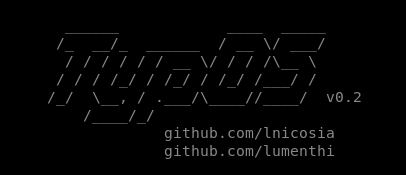

# TypOS [](https://shields.io/) [](https://shields.io/)
  
A tiny _32-bit kernel_ made from scratch with very basic features.

## Summary
* [Introduction](#introduction)
* [Features](#features)
* [Compiling](#compiling)
* [Usage](#usage)
* [Compatibility](#compatibility)
* [Authors](#authors)

## Introduction
The __Kernel From Scratch__ is divided into many projects, each one dealing with a specific aspect of kernel programming.

## Features
- __KFS-1__
    * Boot the kernel with __grub2__
    * Keyboard driver to handle keyboard entries
    * I/O interface: VGA driver
      * Scroll and cursor support.
      * Different screens and keyboard shortcuts to switch easily between them.
      * Color support.
    * Helpers like printk in order to print information / debug easily
- __KFS-2__
    * Memory segmentation (__Global Descriptor Table__) set at address _0x00000800_:
        * _Kernel code_, used to store the executable binary code.
        * _Kernel data_
        * _Kernel stack_, used to store the call stack during kernel execution
        * _User code_, used to store the executable binary code for user programs
        * _User program data_
        * _User stack_, used to store the call stack during execution in userland
    * Minimalistic shell with a few commands:
        * help
        * shutdown
        * reboot
        * stack
        * exit

## Compiling
Run `make` to compile the project, make will compile the `kernel binary` as well as the `kernel iso` under the '___targets___' folder.
```
targets
└── x86
    ├── iso
    │   ├── boot
    │   │   ├── grub
    │   │   │   └── grub.cfg
    │   │   └── kernel.bin
    │   └── linker.ld
    └── kernel.iso
```
Note that, for portability purposes, the iso file is created inside a docker container, be sure to install __Docker__ before running `make`
```
https://docs.docker.com/engine/install
```

## Usage
Of course, you must install __QEMU__ emulator first if you plan to use it.
- __QEMU (manual)__  
After compiling the iso, run __TypOS__ with _QEMU_ emulator by entering the following command  
```qemu-system-i386 -cdrom targets/x86/kernel.iso```
- __QEMU (automatic)__  
Simply run `make run` will compile the project and start _QEMU_ emulation.
- __QEMU (debug)__  
The kernel can be debugged at runtime with _gdb_, run `make debug` then attach the debugger with `exec gdb -x debug.tmp`
- __Another emulator__  
You are free to use your favorite emulator, just compile the kernel then run the ISO with your choosen emulator.

## Compatibility
This given compilation process is only compatible with Linux.

## Authors
* Ludovic Menthiller (https://github.com/lumenthi)
* Lucas Nicosia (https://github.com/lnicosia)
